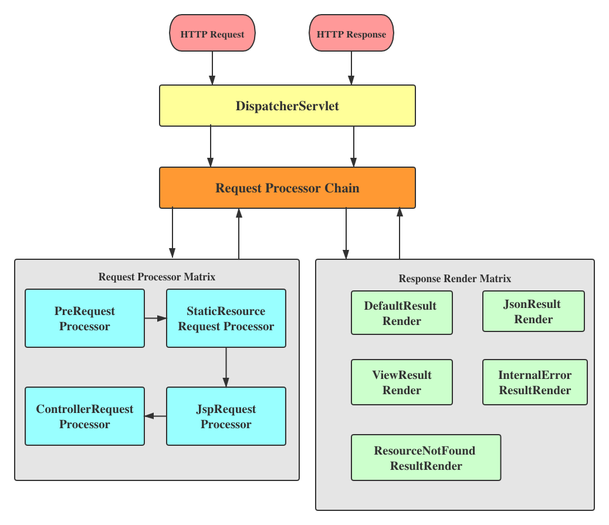

# Spring Framework Impl
---

> GitHub [@Alex Chen](https://github.com/chen-star) &nbsp;&middot;&nbsp;

---

## IOC & DI

### Bean Container & Management

**Bean Types**

|  Annotation 	| 		Status 			| 
:------------ 	| :--------------		| 
| @Component  	| :heavy_check_mark: 	|
| @Controller 	| :heavy_check_mark: 	|
| @Service    	| :heavy_check_mark: 	|
| @ Repository	| :heavy_check_mark: 	|

**Bean Related**

|  Annotation 	| 		Status 			| 
:------------ 	| :--------------		| 
| @Scope  		| :heavy_minus_sign:	|
| @Primiary		| :heavy_minus_sign:	|

* Container Init

~~~java

	Config Files ==> Resource ==> BeanDefinition ==> DI
	
				 Read	      Analyze		    Register
~~~
					

* Store beans
	- `ConcurrentHashMap<Class<?>, Object>`

* Load beans

	- Extract class from given packages
		- Generate class instances
			* Input: the packages to scan
			* Output: the class instances set

			1. Get packages need to scan 
			2. Use ClassLoader to find the URI of the packages
			3. Scan all files under the packages. Use Java reflection to `Class.forName(className);`

			
	- For each extracted class
		- If the class doesn't have defined annotation, container will not manage it.
		- If the class has one, use Java reflection to new instance `clazz.getDeclaredConstructor().newInstance();`

		
* CRUD on beans
	- [Get] 
		- All instances in the container
		- All classes in the container
		- Given class, get instance
		- Given annotation, get class
		- Given super class, get sub classes

	- [Create]
		- Add a bean into container
	
	- [Delete]

### DI - Dependency Injection

|  Annotation 	| 		Status 			| 
:------------ 	| :--------------		| 
| @Autowired  	| :heavy_check_mark: 	|

* Steps: 
	- get all classes in the container
  	- get all fields in this clazz
  	- check if this field has @Autowired
	- get the class type of this field
  	- get instance of this class
 	- use Java reflection to inject filed instance

---
 	
## AOP

|  Annotation 	| 		Status 			| 
:------------ 	| :--------------		| 
| @Asepct		  	| :heavy_check_mark: 	|
| @Order			| :heavy_check_mark: 	|

**Aspect Oriented Programming**: Separation of Concerns

* **Why AOP**
	
	Most of enterprise apps have some common crosscutting concerns that are applicable to different types of modules. (Eg. logging, data validation, transaction management, etc).
	
	In OOP, modularity of apps is achieved by classes whereas in AOP, modularity is done with Aspects and they are configured to cut across different classes.
	
	
* **Glossary**
	- Aspect: An aspect is a class that implements enterprise apps concerns that cut across multiple classes, such as logging.
	
	- Join Point: A specific point in the application such as method execution, exception handling.
	
	- Advice: Actions taken for a particular join point.(like methods in a class)

* **Usage Details**
	
	* Target: `@Pointcut("execution(* com.alex.service..*.*(..))")`
	
		Explanation:
		
		* `*`: any return type
		* package name
		* `..`: current package and its sub-packages
		* `*`: all classes
		* `.*`: every method
		* `(..)`: any args or no arg

	* When: (Advice)
		- `@Before("pointCut method")` 
		- `@After("pointCut method")` 
		- `@Around("pointCut method")` 
		- `@AfterReturning(pointcut = "pointCut method", returning = "returnValues")` 
		- `@AfterThrowing(pointcut = "pointCut method", throwing = "returnValues")`

		- Sequence:
		
		`@Around` => `@Before` => Method execution => `@Around` => `@After` => `@AfterReturning` or `@AfterThrowing`
		
* **Design Pattern**
	
	* JDK Dynamic Proxying (based on Interface)
		
		- JDK Dynamic Proxies allow one to create implementations of Java interfaces at runtime by the means of Reflection.
		- Proxyed Impl class must implements interface

		- Compare with Static Proxying
		
			Let's say if we want to perform some generic actions before calling any method of any class like logging.
			
			- Static Proxying:
				1. Create proxy class for each class
				2. Implement proxy class in a way, that first it make a log entry and then delegate the call to real proxyed obj.
			
			- Dynamic Proxying:
				1. Client make a call
				2. System creates a proxy obj at runtime based on client's call
				3. Proxy obj calls a generic method to perform a generic action in case of each call
				4. After the action, proxy obj delegate the call to proxyed obj.
	
	
	* CGLIB Dynamic Proxying (based on Extension)
		
		- Code Generation Lib
		- Proxyed Impl classes dont have to implement interface
		- Dynamically generate child class to override non-final methods
	
		
* **AspectJ**
	
	- AOP implemented by Java
	- Pointcut syntax
	- Powerful weaving tools
	- Spring AOP only supports Method Execution Joinpoint, whereas AspectJ supports Jointpoint including Method, Constructor, Obj, Field, etc.

	
	- `PointcutParser`: parse pointcut
	- `PointcutExpression`: parse pointcut expression and get actual targets

---
	
## Spring MVC

